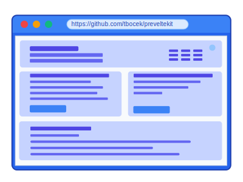
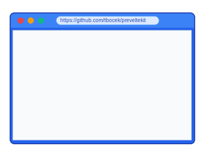
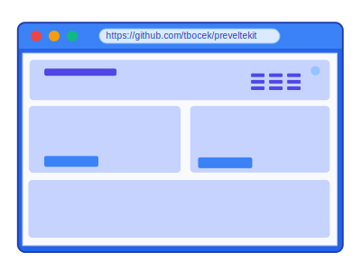

# PrevelteKit
PrevelteKit is a minimalistic (>500 LoC) web application framework built on [Svelte 5](https://svelte.dev/), featuring single page applications with built-time pre-rendering using [Rsbuild](https://rsbuild.dev/) as the build/bundler tool and [jsdom](https://github.com/jsdom/jsdom) as the DOM environment for pre-rendering components during build.

The inspiration for this project comes from the Vue SSR example in the [Rspack examples repository](https://github.com/rspack-contrib/rspack-examples/blob/main/rsbuild/ssr-express/prod-server.mjs). This project adapts those concepts for Svelte, providing a minimal setup.

## Why PrevelteKit?
While there is a go-to solution for SSR for Svelte (SvelteKit), I was missing a minimalistic solution just for build-time pre-rendering. There is the prerender option in SvelteKit, but it's part of SvelteKit that comes with many additional features that might not be necessary for every project.

From an architectural point of view, I prefer the clear separation between view code and server code, where the frontend requests data from the backend via dedicated /api endpoints. This approach treats the frontend as purely static assets (HTML/CSS/JS) that can be served from any CDN or simple web server.

Meta-frameworks such as Next.js, Nuxt.js, SvelteKit blur this separation by requiring a JavaScript runtime (Node.js, Deno, or Bun) to handle server-side rendering, API routes, and build-time generation. While platforms like Vercel and Netlify can help with handling this complex setup (they are great services that I used in the past), serving just static content is much simpler: deploy anywhere (GitHub Pages, S3, any web serve) with predictable performance. You avoid the "full-stack JavaScript" complexity for your deployed frontend - it's just files on a server, nothing more.

## Why Not SvelteKit + adapter-static?
While SvelteKit with adapter-static can achieve similar static site generation, PrevelteKit offers a minimalistic alternative using Svelte + jsdom + Rsbuild. At less than 500 lines of code, it's essentially glue code between these libraries rather than a full framework. This provides a lightweight solution for those who want static pre-rendering without SvelteKit's additional complexity and features.

## Why Rsbuild and not Vite?
While [benchmarks](https://github.com/rspack-contrib/build-tools-performance) show that Rsbuild and Vite (Rolldown + Oxc) have comparable overall performance in many cases (not for the 10k component case - which I do not have in my projects), Rsbuild has a small advantage in producing the smallest compressed bundle size, while Vite (Rolldown + Oxc) have a small advantage in build time performance.

In my experience, Rsbuild "just works" after many updates out of the box with minimal configuration, which reduced friction and setup time. However, I am watching Vite (Rolldown + Oxc) closely, as they are progressing fast.

## Links
 * [npm](https://www.npmjs.com/package/preveltekit)
 * [github](https://github.com/tbocek/preveltekit)
 * [github.io](https://tbocek.github.io/preveltekit)

## Key Features
 * ⚡️ Lightning Fast: Rsbuild bundles in the range of a couple hundred milliseconds
 * 🎯 Simple Routing: Built-in routing system
 * 🔄 Layout and staic content pre-rendered: With Svelte and hydration
 * 📦 Zero Config: Works out of the box with sensible defaults
 * 🛠️ Developer Friendly: Hot reload in development, production-ready in minutes
 * 🛡️ Security: Docker-based development environments to protect against supply chain attacks
 
 ## Automatic Fetch Handling
 
 PrevelteKit automatically manages fetch requests during build-time pre-rendering:
 - Components render with loading states in the pre-rendered HTML
 - No need to wrap fetch calls in `window.__isBuildTime` checks
 - Use Svelte's `{#await}` blocks for clean loading/error/success states
 - If anything went missing, in the worst case, fetch calls timeout after 5 seconds during pre-rendering
 
<table>
<tr>
  <th colspan="2" style="text-align: center;">Rendering Type</th>
</tr>
<tr>
  <th>Initial Load</th>
  <th>After Script Execution</th>
</tr>
<tr>
  <td colspan="2"><strong>SSR</strong> (classic SSR / Next.js / Nuxt)</td>
</tr>
<tr>
  <td><br>User sees fully rendered content instantly</td>
  <td><br>Content remains the same, scripts add interactivity</td>
</tr>
<tr>
  <td colspan="2"><strong>SPA</strong> (React App / pure Svelte)</td>
</tr>
<tr>
  <td><br>User sees blank page or loading spinner</td>
  <td><br>User sees full interactive content</td>
</tr>
<tr>
  <td colspan="2"><strong>SPA + Build-time Pre-Rendering</strong> (this approach)</td>
</tr>
<tr>
  <td><br>User sees pre-rendered static content</td>
  <td><br>Content becomes fully interactive</td>
</tr>
</table>

## Prerequisites
Make sure you have the following installed:
- Node.js (Latest LTS version recommended)
- npm/pnpm or similar

## Quick Start

### Install
```bash
# Create test directory and go into this directory
mkdir -p preveltekit/src && cd preveltekit 
# Declare dependency and the dev script
echo '{"devDependencies": {"preveltekit": "^1.2.3"},"dependencies": {"svelte": "^5.39.11"},"scripts": {"dev": "preveltekit dev"}}' > package.json 
# Download dependencies
npm install 
# A very simple svelte file
echo '<script>let count = $state(0);</script><h1>Count: {count}</h1><button onclick={() => count++}>Click me</button>' > src/Index.svelte 
# And open a browser with localhost:3000
npm run dev 
```

## Slow Start

One example is within this project in the example folder, and another example is the [notary example](https://github.com/tbocek/notary-example). The cli supports the following: dev/stage/prod. 

### Start the development server
```bash
npm run dev
```
This starts an Express development server on http://localhost:3000, with:
- Live reloading
- No optimization for faster builds
- Ideal for rapid development

### Build for production
```bash
npm run build
```
The production build:
- Generates pre-compressed static files for optimal serving with best compression:
    - Brotli (`.br` files)
    - Zstandard (`.zst` files)
    - Zopfli (`.gz` files)
- Optimizes assets for production

### Staging Environment
```bash
npm stage
```
The development server prioritizes fast rebuilds and developer experience, while the production build focuses on optimization and performance. Always test your application with a stage and production build before deploying.

## 🐳 Docker Support
To build with docker in production mode, use:
```bash
docker build . -t preveltekit
docker run -p3000:3000 preveltekit
```

To run in development mode with live reloading, run:
```bash
docker build -f Dockerfile.dev . -t preveltekit-dev
docker run -p3000:3000 -v./src:/app/src preveltekit-dev
```

## Configuration
PrevelteKit uses rsbuild.config.ts for configuration with sensible defaults. To customize settings, create an rsbuild.config.ts file in your project - it will merge with the default configuration.

The framework provides fallback files (index.html and index.ts) from the default folder when you don't supply your own. Once you add your own index.html or index.ts files, PrevelteKit uses those instead, ignoring the defaults.

This approach follows a "convention over configuration" pattern where you only need to specify what differs from the defaults.
