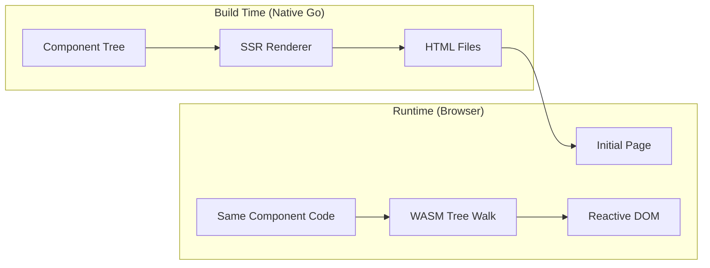

# Preveltekit Architecture

A Go/WASM web framework with SSR pre-rendering. Components are written in pure Go using a declarative DSL. At build time, a native Go binary renders HTML. At runtime, a WASM binary hydrates the pre-rendered HTML by walking the same Render() tree to discover and wire all bindings directly — no intermediate binary format needed.

## Table of Contents

- [Overview](#overview)
- [Lifecycle](#lifecycle)
- [Stores](#stores)
- [Components](#components)
- [Node DSL](#node-dsl)
- [Text Bindings](#text-bindings)
- [Event Bindings](#event-bindings)
- [Input Bindings](#input-bindings)
- [If Blocks](#if-blocks)
- [Each Blocks](#each-blocks)
- [Component Blocks](#component-blocks)
- [Attribute Bindings](#attribute-bindings)
- [CSS Scoping](#css-scoping)
- [Routing](#routing)
- [Fetch API](#fetch-api)
- [Timer Functions](#timer-functions)
- [Storage API](#storage-api)
- [Utilities](#utilities)
- [ID System](#id-system)
- [Comment Marker System](#comment-marker-system)
- [WASM Tree Walking](#wasm-tree-walking)
- [Render Cache](#render-cache)

---

## Overview



The framework has two execution modes sharing the same component code:

1. **SSR (native Go)**: Walks the component tree via `nodeToHTML()`, generates static HTML with comment markers and element IDs.
2. **WASM (browser)**: Walks the same Render() tree via `wasmWalkAndBind()`, discovers all bindings, and wires them to the existing DOM elements using the markers and IDs embedded in the HTML.

Both modes advance the same deterministic ID counters in the same order, so counter-based IDs match between the pre-rendered HTML and the WASM runtime.

---

## Lifecycle

| Step | SSR (Native Go) | WASM (Browser) |
|------|-----------------|----------------|
| 1 | `resetRegistries()` — all counters to 0 | *(counters start at 0)* |
| 2 | `app = App.New()` — creates stores `s0`, `s1`, ... | `app = App.New()` — creates stores `s0`, `s1`, ... **same order** |
| 3 | `app.OnMount()` — creates router, registers handlers `h0`, `h1`, ... | `app.OnMount()` — registers handlers `h0`, `h1`, ... **same order** |
| 4 | `nodeToHTML(app.Render())` — walks node tree, generates HTML with markers | `wasmWalkAndBind(app.Render())` — walks same tree, wires DOM bindings |
| 5 | Write HTML to `dist/{route}.html` | `select{}` — block forever to keep event listeners alive |
| 6 | *(repeat steps 1-5 for each route)* | |

> **Critical invariant**: SSR and WASM must create stores and register handlers in the exact same order, so counter-based IDs (`s0`, `s1`, `h0`, `h1`, ...) match between the HTML and the WASM runtime. Both must also advance marker counters (`t0`, `i0`, `e0`, `r0`, ...) identically — this means both SSR and WASM render ALL branches of if-blocks and ALL options of Store[Component] to keep counters in sync, even though only the active branch is displayed.

**Why `select{}`?** Go's WASM runtime tears down all `js.FuncOf` closures when `main()` returns. Since all event listeners and store callbacks are Go functions exposed to JS, the main goroutine must stay alive for the app to function.

---

## Stores

Stores are the reactive primitive. Every dynamic value is a `Store[T]` or `List[T]`.

### Store[T]

```go
count := p.New(0)           // auto-ID: "s0"
name := p.New("World")      // auto-ID: "s1"
dark := p.New(false)         // auto-ID: "s2"
```

- `New(val)` → auto-generates ID (`s0`, `s1`, ...) via a global counter, registers in `storeRegistry`
- `Get()` → current value
- `Set(v)` → updates value, fires all `OnChange` callbacks
- `Update(fn func(T) T)` → transforms value via function
- `OnChange(func(T))` → subscribes to changes

Internally, `newWithID(id, val)` creates a store with an explicit ID instead of an auto-generated one. This is unexported and used only by the router (`id+".path"`), `LocalStore` (localStorage key as ID), and `List.Len()` (`listID+".len"`), where a predictable ID is needed for lookup.

### Derived Stores (User Pattern)

The framework doesn't include a built-in `Derived` type — it's not needed. Users can write their own helpers using `New` + `OnChange`:

```go
// User-defined helpers (in your app code)
func Derived1[A, R any](a *p.Store[A], fn func(A) R) *p.Store[R] {
    out := p.New(fn(a.Get()))
    a.OnChange(func(_ A) { out.Set(fn(a.Get())) })
    return out
}

func Derived2[A, B, R any](a *p.Store[A], b *p.Store[B], fn func(A, B) R) *p.Store[R] {
    out := p.New(fn(a.Get(), b.Get()))
    a.OnChange(func(_ A) { out.Set(fn(a.Get(), b.Get())) })
    b.OnChange(func(_ B) { out.Set(fn(a.Get(), b.Get())) })
    return out
}

func Derived3[A, B, C, R any](a *p.Store[A], b *p.Store[B], c *p.Store[C], fn func(A, B, C) R) *p.Store[R] {
    out := p.New(fn(a.Get(), b.Get(), c.Get()))
    a.OnChange(func(_ A) { out.Set(fn(a.Get(), b.Get(), c.Get())) })
    b.OnChange(func(_ B) { out.Set(fn(a.Get(), b.Get(), c.Get())) })
    c.OnChange(func(_ C) { out.Set(fn(a.Get(), b.Get(), c.Get())) })
    return out
}

// Usage
uppercase := Derived1(name, strings.ToUpper)
fullName := Derived2(first, last, func(f, l string) string { return f + " " + l })
summary := Derived3(first, last, age, func(f, l string, a int) string {
    return f + " " + l + ", age " + p.Itoa(a)
})
```

The resulting store is a regular `Store[R]` — it works with `Html`, `Bind`, conditions, and everything else.

### List[T]

```go
items := p.NewList("Apple", "Banana", "Cherry")  // auto-ID: "s3"
items.Len()  // derived Store[int] with ID "s3.len"
```

- `NewList(items...)` → auto-ID (shares counter with `Store`), registered in `storeRegistry`
- `Get()` → copy of the slice
- `Set(items)` → replaces entire list (computes minimal diff)
- `Append(items...)` → adds to end
- `RemoveAt(i)` → removes at index
- `Clear()` → removes all
- `Len()` → returns a derived `*Store[int]` that tracks the list length
- `OnChange(func([]T))` → fires on any change

### Handlers

```go
p.Html(`<button>Click</button>`).On("click", myFunc)
```

When `.On()` is called, the handler is registered via `RegisterHandler(fn)` which auto-generates an ID (`h0`, `h1`, ...) and stores it in `handlerRegistry`. The WASM side looks up handlers by ID via `GetHandler(id)`.

---

## Components

A component implements the `Component` interface:

```go
type Component interface {
    Render() Node
}
```

The root app component passed to `Hydrate()` must implement `ComponentRoot`:

```go
type ComponentRoot interface {
    Component
    Routes() []Route
}
```

Optional interfaces (any component):

| Interface | Method | Purpose |
|---|---|---|
| `HasNew` | `New() Component` | Factory/constructor — creates a fresh instance with initialized stores |
| `HasOnMount` | `OnMount()` | Called when component becomes active (before Render) |
| `HasOnDestroy` | `OnDestroy()` | Called when component is removed from DOM (route change, if-block swap) |
| `HasStyle` | `Style() string` | Scoped CSS for this component |
| `HasGlobalStyle` | `GlobalStyle() string` | Unscoped global CSS |

### Example

```go
type Counter struct {
    Count *p.Store[int]
}

func (c *Counter) New() p.Component {
    return &Counter{Count: p.New(0)}
}

func (c *Counter) Increment() {
    c.Count.Update(func(v int) int { return v + 1 })
}

func (c *Counter) Render() p.Node {
    return p.Html(`<div>
        <p>Count: <strong>`, c.Count, `</strong></p>
        `, p.Html(`<button>+1</button>`).On("click", c.Increment), `
    </div>`)
}

func main() {
    p.Hydrate(&Counter{})
}
```

---

## Node DSL

Components build their UI using the node DSL. All functions return `Node` values that form a tree.

### Html

The primary building block. Accepts a mix of strings (raw HTML), nodes, and stores:

```go
p.Html(`<div>`, "hello", `</div>`)          // static HTML
p.Html(`<p>Count: `, myStore, `</p>`)        // auto-binds store as text
p.Html(`<p>`, p.Bind(myStore), `</p>`)       // explicit text binding
```

When a `*Store[T]` is passed directly as a part, it's automatically wrapped in a `BindNode`.

When a `*Store[Component]` with registered options is passed, it becomes a ComponentBlock (see [Component Blocks](#component-blocks)).

### Chainable Methods on Html

```go
p.Html(`<button>Click</button>`).On("click", handler)                 // event
p.Html(`<button>Submit</button>`).On("click", handler).PreventDefault() // with modifier
p.Html(`<input type="text">`).Bind(nameStore)                          // two-way binding
p.Html(`<div>content</div>`).AttrIf("class", condition, "active")      // conditional attr
```

### Other Node Types

```go
p.Bind(store)                                            // reactive text interpolation
p.BindAsHTML(store)                                      // reactive HTML interpolation
p.If(cond, children...).ElseIf(cond, children...).Else(children...)  // conditional
p.Each(list, func(item T, i int) Node { ... })           // list iteration
p.Comp(&MyComponent{Prop: store}, slotContent...)         // nested component
p.Slot()                                                 // slot placeholder in child
```

### Conditions

```go
p.Cond(func() bool { return store.Get() >= 90 }, store)         // any comparison
p.Cond(func() bool { return a.Get() > 0 && b.Get() != "" }, a, b) // multi-store
p.Cond(func() bool { return boolStore.Get() }, boolStore)        // bool store
```

### Attributes

```go
p.Attr("class", "btn primary")                      // static (no stores)
p.Attr("href", "/user/", userIDStore)                // dynamic (string + store parts)
p.Attr("data-theme", themeStore)                     // dynamic (single store)
```

---

## Text Bindings

Text bindings display a store's value in the DOM and update it reactively.

### How It Works

```go
p.Html(`<p>Hello, `, p.Bind(nameStore), `!</p>`)
```

**SSR Output:**
```html
<p>Hello, <!--basics_t0s-->World<!--basics_t0-->!</p>
```

**WASM Tree Walk:**
1. `wasmWalkAndBind` encounters the `BindNode`
2. Advances `NextTextMarker()` → `t0`, builds `markerID` = `"basics_t0"`
3. Subscribes to `nameStore.OnChange`
4. On change, calls `replaceMarkerContent("basics_t0", escapedValue)`

---

## Event Bindings

Event bindings connect DOM events to Go handler functions.

### How It Works

```go
p.Html(`<button>+1</button>`).On("click", c.Increment)
```

**SSR Output:**
```html
<button id="h0" data-on="click">+1</button>
```

**WASM Tree Walk:**
1. `wasmBindHtmlNode` encounters the `HtmlNode` with events
2. Uses the event's pre-registered handler ID (`h0`) as the element ID
3. Looks up the handler via `GetHandler("h0")`
4. Creates a `js.FuncOf` wrapper, calls `addEventListener("click", wrapper)` on the element
5. Checks for modifiers (`PreventDefault`, `StopPropagation`) and applies them in the wrapper

---

## Input Bindings

Two-way data binding between form elements and stores.

### How It Works

```go
p.Html(`<input type="text">`).Bind(nameStore)
p.Html(`<input type="checkbox">`).Bind(boolStore)
```

Each `.Bind()` call gets its own unique element ID via `NextBindID()` (`b0`, `b1`, ...), separate from the store's ID. This allows multiple inputs to bind the same store without duplicate HTML IDs.

**SSR Output** (text input):
```html
<input type="text" id="basics_b0" value="World">
```

**SSR Output** (checkbox):
```html
<input type="checkbox" id="basics_b1" checked>
```

**Supported store types**: `*Store[string]` (text input/textarea), `*Store[int]` (number input), `*Store[bool]` (checkbox).

**WASM Tree Walk:**
1. `wasmBindHtmlNode` detects `h.BoundStore` is set
2. Advances `NextBindID()` to get the bind element ID (matching SSR)
3. Calls the appropriate `BindInput`, `BindInputInt`, or `BindCheckbox`
4. These add bidirectional binding: DOM events → `store.Set()`, `store.OnChange` → DOM property update

---

## If Blocks

Conditional rendering with reactive branch switching.

### How It Works

```go
p.If(p.Cond(func() bool { return score.Get() >= 90 }, score),
    p.Html(`<p class="a">Grade: A</p>`),
).ElseIf(p.Cond(func() bool { return score.Get() >= 80 }, score),
    p.Html(`<p class="b">Grade: B</p>`),
).Else(
    p.Html(`<p class="f">Grade: F</p>`),
)
```

**SSR Output** (assuming score is 95):
```html
<!--basics_i0s--><p class="a">Grade: A</p><!--basics_i0-->
```

SSR renders ALL branches to advance counters, but only outputs the active branch's HTML.

**WASM Tree Walk (`wasmBindIfNode`):**
1. Advances `NextIfMarker()` to get `markerID`
2. **Counter-advance pass**: Walks ALL branches (active and inactive) to advance ID counters in sync with SSR. Saves the `IDCounter` state at the start of each branch in `branchCounters`.
3. **Bind pass**: Restores the saved counter state for the active branch and calls `wasmWalkAndBind` on it to wire up its nested bindings.
4. **Reactive updates**: Subscribes to condition stores. On change:
   - Evaluates conditions to find new active branch
   - Generates new HTML via `wasmNodeToHTML`
   - Calls `replaceMarkerContent(markerID, newHTML)` to swap DOM content
   - Walks the new branch tree to wire its bindings

### Nested Bindings

Each branch can contain its own text bindings, events, nested if-blocks, etc. These are discovered during the tree walk and wired/released when branches swap.

---

## Each Blocks

List rendering with template-based item generation.

### How It Works

```go
p.Each(items, func(item string, i int) p.Node {
    return p.Html(`<li>`, p.Itoa(i), `: `, item, `</li>`)
}).Else(
    p.Html(`<p>No items</p>`),
)
```

**SSR Output** (3 items):
```html
<!--lists_e0s--><li>0: Apple</li><li>1: Banana</li><li>2: Cherry</li><!--lists_e0-->
```

**WASM Tree Walk:**
1. Advances `NextEachMarker()` to get `markerID`
2. Subscribes to `list.OnChange`
3. On change, calls the body function for each item, renders to HTML via `wasmNodeToHTML`, and calls `replaceMarkerContent` with the concatenated HTML

---

## Component Blocks

Dynamic component switching via `Store[Component]` with options.

### How It Works

```go
type App struct {
    Current *p.Store[p.Component]
}

func (a *App) Render() p.Node {
    return p.Html(`<main>`, a.Current, `</main>`)
}
```

When `NewRouter` is called, it registers all possible components via `componentStore.WithOptions(...)`.

**SSR**: Renders ALL option components to advance counters, outputs only the active one between markers:
```html
<main><!--app_r0s--><div class="demo">Basics...</div><!--app_r0--></main>
```

**WASM Tree Walk (`wasmBindStoreComponent`):**
1. Advances `NextRouteMarker()` to get `markerID`
2. Checks `wasmRenderedTrees` cache for pre-rendered trees from the HTML pass (see [Render Cache](#render-cache))
3. If cached: reuses the trees directly. If not (top-level Hydrate): does a counter-advance pass over ALL options
4. **Bind pass**: Walks the active option's tree to wire its bindings
5. **Reactive updates**: On `Store[Component]` change:
   - Renders new component via `wasmNodeToHTML` (caches the tree)
   - Calls `replaceMarkerContent` to swap DOM
   - Walks the cached tree to wire new bindings

---

## Attribute Bindings

### Dynamic Attributes

Template-based attributes with store placeholders:

```go
p.DynAttr("href", "/user/{0}/post/{1}", userIDStore, postIDStore)
```

**SSR Output:**
```html
<a data-attrbind="basics_a0" href="/user/42/post/7">
```

**WASM:** Subscribes to stores, re-evaluates template on change, calls `setAttribute`.

### Conditional Attributes

```go
p.Html(`<div>content</div>`).AttrIf("class", p.Cond(func() bool { return score.Get() >= 90 }, score), "excellent")
```

**SSR Output** (score=95):
```html
<div id="basics_cl0" class="excellent">content</div>
```

**WASM:**
- For `class` attributes: uses `classList.add` / `classList.remove`
- For other attributes: uses `setAttribute` / `removeAttribute`
- Subscribes to condition store and optional value stores

### AttrIf with Two Values

```go
.AttrIf("class", isActive, "active", "inactive")  // true value, false value
```

Both values can be literal strings or stores for fully dynamic behavior.

---

## CSS Scoping

Components with `Style()` get Svelte-style CSS scoping.

### How It Works

```go
func (c *Counter) Style() string {
    return `.demo button { color: blue; }`
}
```

1. Each styled component gets a unique scope class (`v0`, `v1`, ...) via `GetOrCreateScope()`
2. CSS rules are rewritten to include the scope:

```css
/* Before */
.demo button { color: blue; }

/* After scoping with "v0" */
.demo.v0 button.v0 { color: blue; }
```

3. All HTML tags rendered within that component get the scope class injected via `injectScopeClass()`
4. Scoped CSS is collected during SSR and emitted in a `<style>` tag in the HTML head

The `injectScopeClass` function handles tags split across multiple `HtmlNode` parts (e.g., `<div class="alert" ` + DynAttr + `>`) by injecting the scope class even when the closing `>` isn't in the current string part.

---

## Routing

Client-side SPA routing that integrates with `Store[Component]` and ComponentBlocks.

### Setup

```go
type App struct {
    CurrentComponent *p.Store[p.Component]
    routes           []p.Route
}

func (a *App) OnMount() {
    router := p.NewRouter(a.CurrentComponent, a.routes, "app")
    router.Start()
}
```

### SSR Behavior

- `NewRouter` calls `componentStore.WithOptions(...)` to register all route components
- `Start()` reads the SSR path (set via `SetSSRPath`) and calls `handleRoute()`
- The SSR renderer renders all route component branches

### Router Methods

| Method | Purpose |
|--------|---------|
| `Start()` | Handles initial route, listens for `popstate`, sets up link interception |
| `Navigate(path)` | Programmatic navigation (pushes history state) |
| `Replace(path)` | Navigate without adding to history |
| `CurrentPath() *Store[string]` | Reactive store containing the current path |
| `NotFound(handler func())` | Set handler for unmatched routes |
| `BeforeNavigate(fn func(from, to string) bool)` | Navigation guard — return false to cancel |
| `SetupLinks()` | Intercept all `<a>` clicks for SPA navigation (called by Start) |

### WASM Behavior

- `SetupLinks()` intercepts all `<a>` clicks on the document
- Skips external links, `target="_blank"`, modifier keys, hash-only links
- Calls `Navigate(path)` which pushes history state and triggers route matching
- Route matching uses specificity scoring (exact segments > parameters > wildcards)
- The `popstate` event handler enables back/forward navigation

---

## Fetch API

Generic HTTP client wrapping the browser's `fetch()` API. Uses the Codec system internally to encode Go structs to JS objects and decode JS responses back to Go structs via `js` struct tags.

### Functions

```go
todo, err := p.Get[Todo]("https://api.example.com/todos/1")
user, err := p.Post[User]("/api/users", newUser)
updated, err := p.Put[Post]("/api/posts/1", postData)
patched, err := p.Patch[Post]("/api/posts/1", partial)
_, err := p.Delete[any]("/api/posts/1")
```

### FetchOptions

For full control, use `Fetch` directly:

```go
signal, abort := p.NewAbortController()
result, err := p.Fetch[Post]("/api/posts", &p.FetchOptions{
    Method:  "POST",
    Body:    postData,
    Headers: map[string]string{"Authorization": "Bearer token"},
    Signal:  signal,
})
// abort() to cancel the request
```

### FetchError

On HTTP errors (non-2xx), returns `*FetchError` with `Status`, `StatusText`, and `URL`.

### SSR Behavior

All fetch functions return zero values and an error during SSR (`IsBuildTime == true`). Use `IsBuildTime` to guard fetch calls in `OnMount()`.

---

## Timer Functions

Timer utilities that wrap browser `setInterval`/`setTimeout` with proper cleanup.

| Function | Signature | Returns |
|----------|-----------|---------|
| `SetInterval` | `(ms int, callback func()) func()` | Stop function |
| `SetTimeout` | `(ms int, callback func()) func()` | Cancel function |
| `Debounce` | `(ms int, callback func()) (func(), func())` | Debounced function + cleanup |
| `Throttle` | `(ms int, callback func()) func()` | Throttled function |

```go
func (b *Bitcoin) OnMount() {
    stop := p.SetInterval(30000, b.FetchPrice)
    b.cleanup = stop
}

func (b *Bitcoin) OnDestroy() {
    b.cleanup()
}
```

During SSR, all timer functions are no-ops that return no-op stop/cancel functions.

---

## Storage API

Wrapper around browser `localStorage`.

### Low-level Functions

```go
p.SetStorage("key", "value")
val := p.GetStorage("key")
p.RemoveStorage("key")
p.ClearStorage()
```

### LocalStore

A `*Store[string]` that auto-syncs with `localStorage`:

```go
theme := p.NewLocalStore("theme", "light")  // reads localStorage on creation
theme.Set("dark")                            // updates both store and localStorage
```

`LocalStore` uses `newWithID(key, defaultValue)` internally so the localStorage key doubles as the store ID.

During SSR, storage functions are no-ops — `GetStorage` returns `""`, `NewLocalStore` returns a regular store with the default value.

---

## Utilities

### IsBuildTime

```go
const IsBuildTime = true   // during SSR (native Go build)
const IsBuildTime = false  // during WASM (browser)
```

Use to guard browser-only code in `OnMount()`:

```go
func (f *Fetch) OnMount() {
    if !p.IsBuildTime {
        f.LoadData()
    }
}
```

### Itoa

```go
p.Itoa(42)  // "42"
```

Lightweight int-to-string conversion exposed for use in examples and user code, avoiding the need to import `strconv` (which adds ~20kb to the WASM binary).

---

## ID System

All IDs are counter-based and deterministic. SSR and WASM must increment counters in the same order.

### ID Types

| Prefix | Generator | Used For | Example |
|--------|-----------|----------|---------|
| `s` | `nextStoreID()` | Store/List registration | `s0`, `s1`, `s2` |
| `h` | `nextHandlerID()` | Handler registration + event element IDs | `h0`, `h1`, `h2` |
| `v` | `GetOrCreateScope()` | CSS scope classes | `v0`, `v1` |
| `t` | `NextTextMarker()` | Text binding comments | `<!--t0-->` |
| `i` | `NextIfMarker()` | If-block comments | `<!--i0s-->...<!--i0-->` |
| `e` | `NextEachMarker()` | Each-block comments | `<!--e0s-->...<!--e0-->` |
| `c` | `NextCompMarker()` | Component ID prefix | `components_c0_t0` |
| `r` | `NextRouteMarker()` | Route/component-block comments | `<!--r0s-->...<!--r0-->` |
| `b` | `NextBindID()` | Input binding element IDs | `id="b0"` |
| `cl` | `NextClassID()` | Class binding element IDs | `id="cl0"` |
| `a` | `NextAttrID()` | Attribute binding element IDs | `data-attrbind="a0"` |

### Prefixing

Nested components get prefixed IDs to avoid collisions:

```
App (prefix: "")
├── Store s0, s1         → "s0", "s1"
├── Handler h0           → "h0"
├── Text marker t0       → "t0"
└── Component "basics" (prefix: "basics")
    ├── Store s2, s3     → still "s2", "s3" (stores use global IDs)
    ├── Text marker t0   → "basics_t0"
    ├── If marker i0     → "basics_i0"
    └── Component "card" (prefix: "basics_c0")
        └── Text marker t0 → "basics_c0_t0"
```

Store and handler IDs are global (no prefix). Marker and element IDs are prefixed per component context.

---

## Comment Marker System

The framework uses a unified comment marker pair pattern for all block constructs that swap DOM content:

```html
<!--{markerID}s-->content<!--{markerID}-->
```

- **Start marker** `<!--{id}s-->`: marks where the block's content begins
- **End marker** `<!--{id}-->`: marks where the block's content ends

### replaceMarkerContent

All block types (text, if, each, component) use the same DOM replacement function:

```
replaceMarkerContent(markerID, newHTML):
  1. Find <!--{markerID}--> (end marker)
  2. Find <!--{markerID}s--> (start marker)
  3. Remove all DOM nodes between start and end
  4. Parse newHTML via <template> element
  5. Insert fragment before end marker
```

This approach:
- Avoids `innerHTML` on parent elements (which can mangle invalid nesting)
- Avoids wrapper elements — content is inserted as bare DOM nodes
- Works regardless of HTML content model (`<ul>`, `<table>`, `<select>`, etc.)
- Both markers persist across replacements

---

## WASM Tree Walking

The WASM hydration walks the same Render() tree that SSR uses, but instead of generating HTML, it wires DOM bindings.

### Two Contexts

| | SSR (`BuildContext`) | WASM (`WASMRenderContext`) |
|---|---|---|
| **Contains** | IDCounter, SlotContent, CollectedStyles, ScopeAttr | IDCounter, ScopeAttr |
| **Purpose** | Generate HTML string | Advance counters, discover bindings |
| **Entry** | `nodeToHTML(tree, ctx)` | `wasmWalkAndBind(tree, ctx, cleanup)` |

Both contexts embed `IDCounter` so they advance markers identically.

### WASM HTML Generation

When a reactive update requires new HTML (e.g., if-block branch swap, each-block re-render, component switch), WASM generates HTML using `wasmNodeToHTML()`. This mirrors SSR's `nodeToHTML()` but runs in the browser. The generated HTML is inserted via `replaceMarkerContent`, then the tree is walked again with `wasmWalkAndBind` to wire bindings for the new content.

### Counter Synchronization for Branches

Both SSR and WASM must render ALL branches of if-blocks and ALL options of Store[Component] to advance counters identically, even for inactive branches. This ensures marker IDs like `basics_i0`, `basics_e0` match between the pre-rendered HTML and the WASM runtime.

For if-blocks, `wasmBindIfNode` saves the IDCounter state at the start of each branch (`branchCounters`) so the active branch can be walked for binding with the correct counter values.

---

## Render Cache

`Render()` has side effects — it calls `.On("click", handler)` which registers handlers with auto-incrementing IDs. Calling `Render()` multiple times produces different handler IDs. The caching system ensures each component's `Render()` is called exactly once.

### ComponentNode Cache

`ComponentNode` has a `renderCache` field. When `wasmComponentNodeToHTML` renders a component for HTML generation, it stores the result in `renderCache`. When `wasmBindComponentNode` later walks the same component for binding, it reuses the cached tree instead of calling `Render()` again.

### Store[Component] Cache

`wasmRenderedTrees` is a global map keyed by marker ID. When `wasmStoreComponentToHTML` renders all options of a Store[Component] for HTML generation, it caches each option's Render() tree. When `wasmBindStoreComponent` later processes the same Store[Component], it finds the cached trees and skips the redundant counter-advance pass.

```go
type wasmCachedOption struct {
    comp      Component
    name      string
    tree      Node
    scopeAttr string
}
var wasmRenderedTrees = make(map[string][]wasmCachedOption)
```


## Downsides of WASM

Go-to-WASM is usable today but comes with real trade-offs. Here's the current state as of early 2026.

### Binary Size

The Go compiler ships a full runtime (goroutine scheduler, garbage collector, `reflect`, etc.) in every WASM binary. The practical floor for a "hello world" is ~2MB gzipped. Our framework binary is ~208kb *after* gzip + `wasm-opt -Oz`, which is good for a Go WASM app but still large compared to a JavaScript framework (~5-30kb). Every new standard library import (`strconv`, `fmt`, `regexp`) pulls in additional weight because the linker can't tree-shake as aggressively as JS bundlers.

**TinyGo** can produce much smaller binaries (10-100kb) but lacks full `reflect` support and has an incomplete standard library, making it unsuitable for this framework's generic store system.

### The JS Bridge (`syscall/js`)

All DOM access from Go WASM goes through `syscall/js`, which is a JavaScript FFI layer. Every call — `getElementById`, `addEventListener`, `setAttribute` — crosses the WASM↔JS boundary. This has measurable overhead:

- **~10x slower** than equivalent native JavaScript for DOM-heavy operations (per Go issue [#32591](https://github.com/golang/go/issues/32591)).
- Each `js.FuncOf` allocates a Go closure and registers it in a lookup table that the JS side calls back into, adding GC pressure.
- Values passed between Go and JS must be serialized/deserialized (no shared memory for objects).

For this framework, the impact is mitigated because DOM operations happen at reactive granularity (only when a store changes), not in a hot render loop. But it means Go WASM will never match the raw DOM throughput of a JS framework like Svelte or SolidJS.

### Garbage Collection

Go ships its own GC inside the WASM binary. The browser's GC and Go's GC are completely independent — they don't cooperate. This means:

- **Double GC overhead**: The browser GCs the JS heap (including all `js.Value` wrappers), while Go separately GCs its own linear memory.
- **Stop-the-world pauses**: Go's GC can cause long STW pauses in WASM (see issue [#54444](https://github.com/golang/go/issues/54444)), because WASM is single-threaded — there's no way to run GC concurrently with application code.
- **No WasmGC integration yet**: The [WasmGC proposal](https://github.com/WebAssembly/gc) lets languages use the browser's built-in GC instead of shipping their own. Chrome, Firefox, and Safari all support WasmGC now, and languages like Dart and Kotlin already target it. Go has an open issue ([#63904](https://github.com/golang/go/issues/63904)) but the work is blocked by fundamental mismatches — WasmGC doesn't support interior pointers, which Go requires for efficient struct access. Without them, every struct field would need boxing, killing performance.

### No Direct DOM Access

WASM cannot call browser APIs (DOM, fetch, localStorage) directly. Everything must go through JavaScript glue code. There is no formal proposal to change this — the [Web IDL bindings](https://github.com/nicolo-ribaudo/tc39-proposal-wasm-legacy-type-reflection) concept could theoretically allow WASM to call DOM APIs natively, but standardizing it would require agreement across all browser vendors on a low-level DOM API, which hasn't happened in the 8+ years since WASM launched.

The **Component Model** and **Interface Types** (WIT) are solving the interop problem for server-side WASM (WASI), but they don't address browser DOM access.

### Single-Threaded Execution

Go's goroutines work in WASM but run on a single OS thread — there's no parallel execution. The WASM threads proposal exists but isn't universally deployed, and Go's WASM target doesn't use it. This means:

- `select{}` blocks the main thread (necessary to keep event listeners alive)
- CPU-intensive Go code will freeze the UI
- `go func()` provides concurrency (interleaving) but not parallelism

### What Could Change

| Improvement | Status | Impact |
|-------------|--------|--------|
| **WasmGC for Go** | Blocked on interior pointer support ([#63904](https://github.com/golang/go/issues/63904)) | Would eliminate shipped GC, shrink binaries by ~1MB, remove STW pauses |
| **Direct DOM access** | No formal proposal | Would eliminate `syscall/js` overhead entirely |
| **WASM threads** | Proposal exists, not in Go's WASM target | Would enable parallel goroutines, concurrent GC |
| **Component Model in browsers** | Server-side (WASI 0.3) is maturing, browser story unclear | Could provide typed DOM bindings without JS glue |

### Why Go WASM Anyway?

Despite these limitations, Go WASM is practical for apps where:

- **Type safety and compile-time checks** matter more than raw DOM performance
- **Shared logic** between server and client (same language, same types)
- **Reactivity granularity is coarse** — updating a few DOM elements per user interaction is fast enough even through the JS bridge
- **Developer productivity** — Go's tooling, error handling, and simplicity vs. JavaScript's ecosystem complexity

The framework's design (SSR pre-rendering + surgical hydration) minimizes the WASM runtime's job to only wiring reactive bindings, which keeps the JS bridge crossings low.