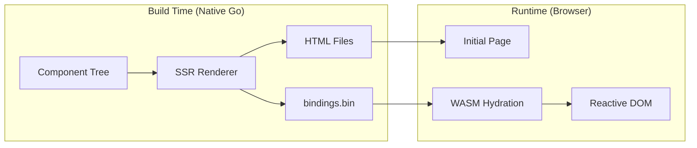
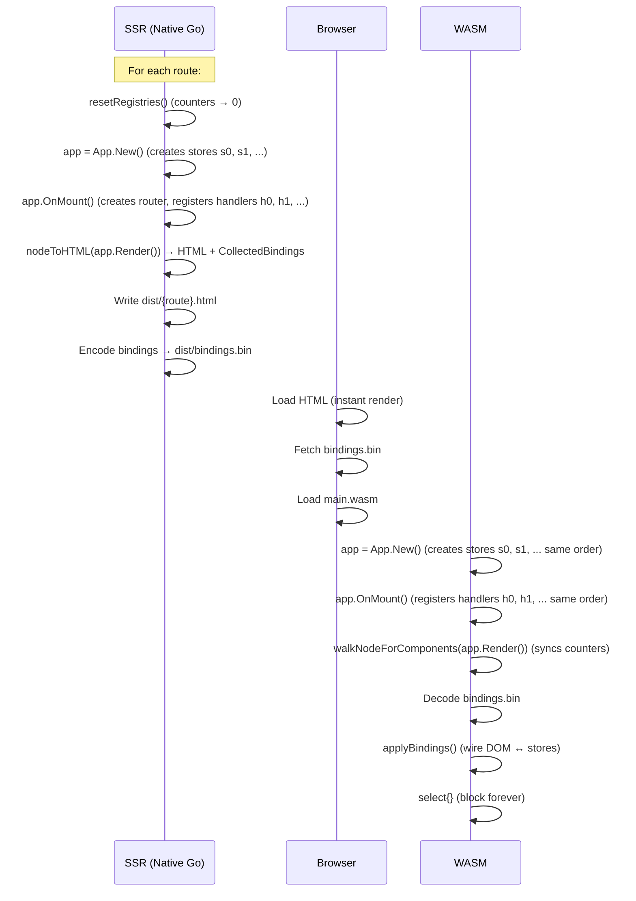
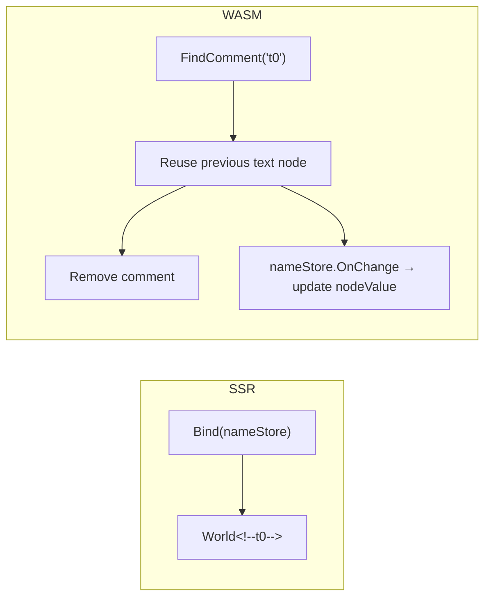
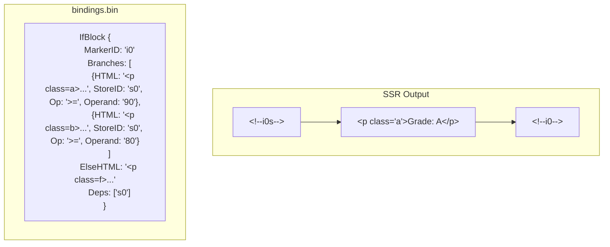
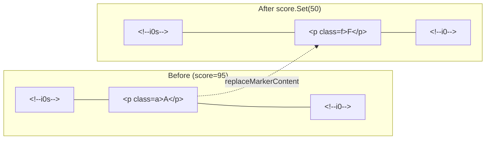
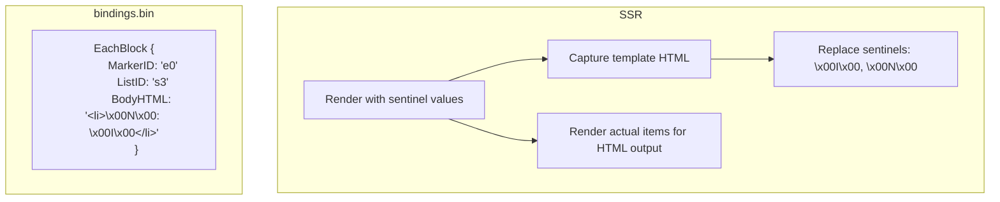
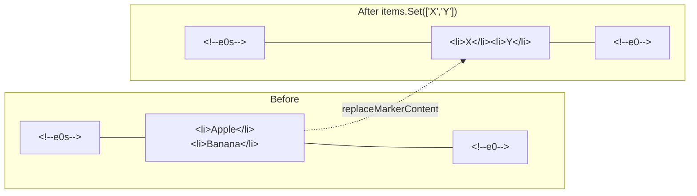
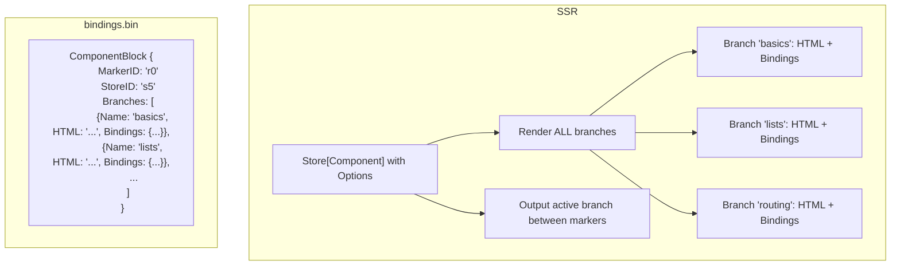
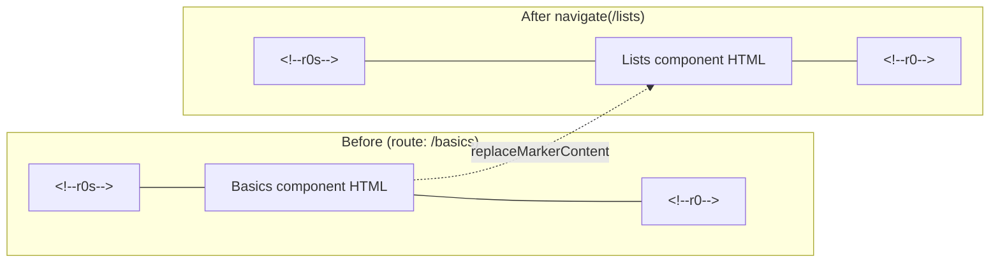
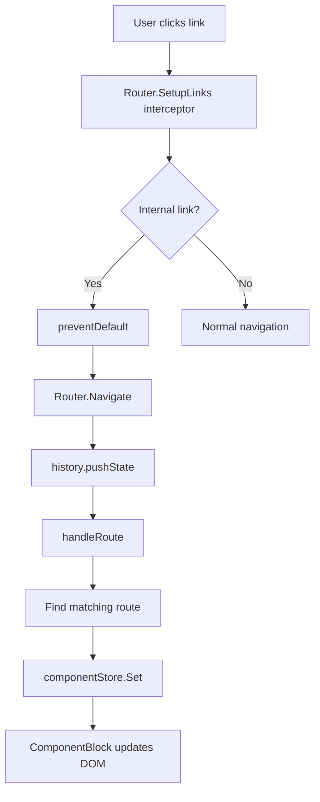

# Preveltekit Architecture

A Go/WASM web framework with SSR pre-rendering. Components are written in pure Go using a declarative DSL. At build time, a native Go binary renders HTML and collects reactive bindings into a compact binary. At runtime, a WASM binary hydrates the pre-rendered HTML with reactivity.

## Table of Contents

- [Overview](#overview)
- [Lifecycle](#lifecycle)
- [Stores](#stores)
- [Components](#components)
- [Node DSL](#node-dsl)
- [Text Bindings](#text-bindings)
- [Event Bindings](#event-bindings)
- [Input Bindings](#input-bindings)
- [If Blocks](#if-blocks)
- [Each Blocks](#each-blocks)
- [Component Blocks](#component-blocks)
- [Attribute Bindings](#attribute-bindings)
- [CSS Scoping](#css-scoping)
- [Routing](#routing)
- [ID System](#id-system)
- [Bindings Binary](#bindings-binary)
- [File Reference](#file-reference)

---

## Overview



The framework has two execution modes sharing the same component code:

1. **SSR (native Go)**: Walks the component tree, generates static HTML with comment markers and element IDs, collects all reactive binding metadata into `bindings.bin`.
2. **WASM (browser)**: Loads the pre-rendered HTML, decodes `bindings.bin`, and wires up reactivity — connecting stores to DOM elements via the markers and IDs embedded in the HTML.

---

## Lifecycle



The critical invariant: **SSR and WASM must create stores and register handlers in the exact same order**, so counter-based IDs (`s0`, `s1`, `h0`, `h1`, ...) match between the HTML and the WASM runtime.

---

## Stores

Stores are the reactive primitive. Every dynamic value is a `Store[T]` or `List[T]`.

### Store[T]

```go
count := p.New(0)           // auto-ID: "s0"
name := p.New("World")      // auto-ID: "s1"
dark := p.New(false)         // auto-ID: "s2"
path := p.NewWithID("mypath", "/home")  // explicit ID
```

- `New(val)` → auto-generates ID (`s0`, `s1`, ...) via a global counter, registers in `storeRegistry`
- `NewWithID(id, val)` → explicit ID, also registered
- `Get()` → current value
- `Set(v)` → updates value, fires all `OnChange` callbacks
- `Update(fn func(T) T)` → transforms value via function
- `OnChange(func(T))` → subscribes to changes

Stores are looked up by ID during WASM hydration via `GetStore(id)`.

### List[T]

```go
items := p.NewList("Apple", "Banana", "Cherry")  // auto-ID: "s3"
items.Len()  // derived Store[int] with ID "s3.len"
```

- `NewList(items...)` → auto-ID (shares counter with `Store`), registered in `storeRegistry`
- `Get()` → copy of the slice
- `Set(items)` → replaces entire list (computes minimal diff)
- `Append(items...)` → adds to end
- `RemoveAt(i)` → removes at index
- `Clear()` → removes all
- `Len()` → returns a derived `*Store[int]` that tracks the list length (lazily created with ID `listID + ".len"`)
- `OnChange(func([]T))` → fires on any change
- `OnEdit(func(Edit[T]))` → fires per individual edit operation

### Handlers

```go
p.Html(`<button>Click</button>`).On("click", myFunc)
```

When `.On()` is called, the handler is registered via `RegisterHandler(fn)` which auto-generates an ID (`h0`, `h1`, ...) and stores it in `handlerRegistry`. The WASM side looks up handlers by ID via `GetHandler(id)`.

---

## Components

A component implements the `Component` interface:

```go
type Component interface {
    Render() Node
}
```

Optional interfaces:

| Interface | Method | Purpose |
|---|---|---|
| `HasNew` | `New() Component` | Create fresh instance (required for SSR iteration) |
| `HasOnMount` | `OnMount()` | Lifecycle hook (called before Render in both SSR and WASM) |
| `HasRoutes` | `Routes() []Route` | Define routes for the app |
| `HasStyle` | `Style() string` | Scoped CSS for this component |
| `HasGlobalStyle` | `GlobalStyle() string` | Unscoped global CSS |

### Example

```go
type Counter struct {
    Count *p.Store[int]
}

func (c *Counter) New() p.Component {
    return &Counter{Count: p.New(0)}
}

func (c *Counter) Increment() {
    c.Count.Update(func(v int) int { return v + 1 })
}

func (c *Counter) Render() p.Node {
    return p.Html(`<div>
        <p>Count: <strong>`, c.Count, `</strong></p>
        `, p.Html(`<button>+1</button>`).On("click", c.Increment), `
    </div>`)
}

func main() {
    p.Hydrate(&Counter{})
}
```

---

## Node DSL

Components build their UI using the node DSL. All functions return `Node` values that form a tree.

### Html

The primary building block. Accepts a mix of strings (raw HTML), nodes, and stores:

```go
p.Html(`<div>`, "hello", `</div>`)          // static HTML
p.Html(`<p>Count: `, myStore, `</p>`)        // auto-binds store as text
p.Html(`<p>`, p.Bind(myStore), `</p>`)       // explicit text binding
```

When a `*Store[T]` is passed directly as a part, it's automatically wrapped in a `BindNode`.

When a `*Store[Component]` with registered options is passed, it becomes a `ComponentBlock` (see [Component Blocks](#component-blocks)).

### Chainable Methods on Html

```go
p.Html(`<button>Click</button>`).On("click", handler)                 // event
p.Html(`<button>Submit</button>`).On("click", handler).PreventDefault() // with modifier
p.Html(`<input type="text">`).Bind(nameStore)                          // two-way binding
p.Html(`<div>content</div>`).AttrIf("class", condition, "active")      // conditional attr
```

### Other Node Types

```go
p.Text("plain text")                                    // escaped text node
p.Frag(node1, node2, node3)                              // fragment (no wrapper)
p.Bind(store)                                            // reactive text interpolation
p.BindAsHTML(store)                                      // reactive HTML interpolation
p.If(cond, children...).ElseIf(cond, children...).Else(children...)  // conditional
p.Each(list, func(item T, i int) Node { ... })           // list iteration
p.Comp(&MyComponent{Prop: store}, slotContent...)         // nested component
p.Slot()                                                 // slot placeholder in child
```

### Conditions

```go
store.Ge(90)          // store >= 90
store.Gt(0)           // store > 0
store.Lt(100)         // store < 100
store.Eq("hello")     // store == "hello"
store.Ne("goodbye")   // store != "goodbye"
p.IsTrue(boolStore)   // bool store is true
p.IsFalse(boolStore)  // bool store is false
```

### Attributes

```go
p.Class("btn", "primary")                          // static class
p.StaticAttribute("data-id", "42")                  // static attribute
p.DynAttr("href", "/user/{0}", userIDStore)         // dynamic attribute with placeholder
p.Prop("Title", titleStore)                          // component prop
```

---

## Text Bindings

Text bindings display a store's value in the DOM and update it reactively.

### How It Works

```go
p.Html(`<p>Hello, `, p.Bind(nameStore), `!</p>`)
```



**SSR Output** (text mode):
```html
<p>Hello, World<!--basics_t0-->!</p>
```

**SSR Output** (HTML mode, via `BindAsHTML`):
```html
<p>Hello, <span>World</span><!--basics_t0-->!</p>
```

**WASM Hydration:**
1. Finds the comment `<!--basics_t0-->`
2. Checks `previousSibling` — if it's a text node, reuses it
3. Removes the comment node (no longer needed)
4. Subscribes to `nameStore.OnChange` → updates the text node's `nodeValue`

The comment marker is consumed during hydration — it exists only to locate the text node during initial binding.

---

## Event Bindings

Event bindings connect DOM events to Go handler functions.

### How It Works

```go
p.Html(`<button>+1</button>`).On("click", c.Increment)
```

```mermaid
graph LR
    subgraph SSR
        A[".On('click', handler)"] --> B["RegisterHandler → h0"]
        B --> C['&lt;button id="h0" data-on="click"&gt;']
    end
    subgraph WASM
        D["GetHandler('h0')"] --> E["addEventListener('click', wrapper)"]
    end
```

**SSR Output:**
```html
<button id="h0" data-on="click">+1</button>
```

**Bindings entry:**
```
Event { ElementID: "h0", Event: "click" }
```

**WASM Hydration:**
1. Looks up handler function via `GetHandler("h0")`
2. Creates a `js.FuncOf` wrapper that calls the handler
3. Calls `addEventListener("click", wrapper)` on the element

### Event Modifiers

```go
p.Html(`<form>`).On("submit", handler).PreventDefault()
```

Modifiers are stored alongside the handler. The WASM event wrapper checks modifiers and calls `event.preventDefault()` or `event.stopPropagation()` before invoking the handler.

---

## Input Bindings

Two-way data binding between form elements and stores.

### How It Works

```go
p.Html(`<input type="text">`).Bind(nameStore)
p.Html(`<input type="checkbox">`).Bind(boolStore)
```

```mermaid
graph LR
    subgraph SSR
        A[".Bind(nameStore)"] --> B['&lt;input id="s1" value="World"&gt;']
    end
    subgraph WASM
        C["addEventListener('input')"] --> D["store.Set(el.value)"]
        E["store.OnChange"] --> F["el.value = newVal"]
    end
```

**SSR Output** (text input):
```html
<input type="text" id="s1" value="World">
```

**SSR Output** (checkbox):
```html
<input type="checkbox" id="s2" checked>
```

**Bindings entry:**
```
InputBinding { StoreID: "s1", BindType: "value" }
```

**WASM Hydration:**
1. Finds element by store ID
2. Adds `input` event listener → calls `store.Set(element.value)`
3. Subscribes to `store.OnChange` → sets `element.value`

For checkboxes, uses `change` event and the `checked` property instead.

---

## If Blocks

Conditional rendering with reactive branch switching.

### How It Works

```go
p.If(score.Ge(90),
    p.Html(`<p class="a">Grade: A</p>`),
).ElseIf(score.Ge(80),
    p.Html(`<p class="b">Grade: B</p>`),
).Else(
    p.Html(`<p class="f">Grade: F</p>`),
)
```



**SSR Output** (assuming score is 95):
```html
<!--basics_i0s--><p class="a">Grade: A</p><!--basics_i0-->
```

All branch HTMLs are pre-baked into `bindings.bin`. Only the active branch is rendered in the SSR HTML.

**WASM Hydration:**
1. Subscribes to all dependency stores (`Deps`)
2. On change, evaluates conditions to find the new active branch
3. If branch changed, calls `replaceMarkerContent("basics_i0", newHTML)`:
   - Finds `<!--basics_i0s-->` (start) and `<!--basics_i0-->` (end)
   - Removes all DOM nodes between them
   - Parses new HTML via `<template>` element
   - Inserts fragment before end marker
4. Releases old branch bindings, applies new branch bindings



### Nested Bindings

Each branch can contain its own text bindings, events, nested if-blocks, etc. These are stored per-branch in `bindings.bin` and applied/released when branches swap.

---

## Each Blocks

List rendering with template-based item generation.

### How It Works

```go
p.Each(items, func(item string, i int) p.Node {
    return p.Html(`<li>`, itoa(i), `: `, item, `</li>`)
})
```



**SSR Template Capture:**

The SSR renderer calls the body function once with sentinel values:
- String lists: item = `\x00ITEM_SENTINEL\x00`, index = `9999999`
- Int lists: item = `8888888`, index = `9999999`

The rendered HTML is captured and sentinels are replaced with compact markers:
- `\x00ITEM_SENTINEL\x00` → `\x00I\x00`
- `9999999` → `\x00N\x00`

This produces the `BodyHTML` template stored in `bindings.bin`.

**SSR Output** (3 items):
```html
<!--lists_e0s--><li>0: Apple</li><li>1: Banana</li><li>2: Cherry</li><!--lists_e0-->
```

Items are rendered directly — no wrapper elements.

**WASM Hydration:**
1. Resolves the list store via `GetStore("s3")`
2. Subscribes to `list.OnChange`
3. On change, for each item:
   - Replaces `\x00I\x00` with the item value
   - Replaces `\x00N\x00` with the index
4. Calls `replaceMarkerContent("lists_e0", concatenatedHTML)`



---

## Component Blocks

Dynamic component switching via `Store[Component]` with pre-baked branches.

### How It Works

```go
// In App:
type App struct {
    Current *p.Store[p.Component]
}

func (a *App) OnMount() {
    router := p.NewRouter(a.Current, a.routes, "app")
    router.Start()
}

func (a *App) Render() p.Node {
    return p.Html(`<main>`, a.Current, `</main>`)
    //                      ^^^^^^^^^ Store[Component] with options
}
```

When `NewRouter` is called, it calls `componentStore.WithOptions(route.Component...)` to register all possible components. This tells the SSR renderer to pre-bake all branches.



**SSR Output** (active component is `basics`):
```html
<main><!--r0s--><div class="demo"><h1>Basics</h1>...</div><!--r0--></main>
```

All component branch HTMLs and their nested bindings are stored in `bindings.bin`.

**WASM Hydration:**
1. First call: skips DOM swap (trusts SSR content), applies active branch bindings
2. On `Store[Component]` change:
   - Gets new component's type name via reflection
   - Finds matching branch by name
   - Calls `replaceMarkerContent("r0", branchHTML)`
   - Releases old bindings, applies new branch bindings



---

## Attribute Bindings

### Dynamic Attributes

Template-based attributes with store placeholders:

```go
p.DynAttr("href", "/user/{0}/post/{1}", userIDStore, postIDStore)
```

**SSR Output:**
```html
<a data-attrbind="basics_a0" href="/user/42/post/7">
```

**WASM:** Subscribes to stores, re-evaluates template on change, calls `setAttribute`.

### Conditional Attributes

```go
p.Html(`<div>content</div>`).AttrIf("class", score.Ge(90), "excellent")
```

**SSR Output** (score=95):
```html
<div id="basics_cl0" class="excellent">content</div>
```

**WASM:**
- For `class` attributes: uses `classList.add` / `classList.remove` for efficient toggling
- For other attributes: uses `setAttribute` / `removeAttribute`
- Subscribes to condition store and optional value stores

### AttrIf with Two Values

```go
.AttrIf("class", isActive, "active", "inactive")  // true value, false value
```

Both values can be literal strings or stores for fully dynamic behavior.

---

## CSS Scoping

Components with `Style()` get Svelte-style CSS scoping.

### How It Works

```go
func (c *Counter) Style() string {
    return `
        .demo button { color: blue; }
        .demo button:hover { color: red; }
    `
}
```

1. Each styled component gets a unique scope class (`v0`, `v1`, ...) via `GetOrCreateScope()`
2. The CSS rules are rewritten to include the scope:

```css
/* Before */
.demo button { color: blue; }
.demo button:hover { color: red; }

/* After scoping with "v0" */
.demo.v0 button.v0 { color: blue; }
.demo.v0 button.v0:hover { color: red; }
```

3. All HTML tags rendered within that component get the scope class injected:

```html
<!-- Before scoping -->
<div class="demo"><button>Click</button></div>

<!-- After scoping with "v0" -->
<div class="demo v0"><button class="v0">Click</button></div>
```

4. Scoped CSS is collected during SSR and emitted in a `<style>` tag in the HTML head.

---

## Routing

Client-side SPA routing that integrates with `Store[Component]` and ComponentBlocks.

### Setup

```go
type App struct {
    CurrentComponent *p.Store[p.Component]
    routes           []p.Route
}

func (a *App) New() p.Component {
    basics := (&Basics{}).New()
    lists := (&Lists{}).New()

    return &App{
        CurrentComponent: p.New(basics),
        routes: []p.Route{
            {Path: "/basics", HTMLFile: "basics.html", SSRPath: "/basics", Component: basics},
            {Path: "/lists",  HTMLFile: "lists.html",  SSRPath: "/lists",  Component: lists},
        },
    }
}

func (a *App) OnMount() {
    router := p.NewRouter(a.CurrentComponent, a.routes, "app")
    router.Start()
}
```

### SSR Behavior

- `NewRouter` calls `componentStore.WithOptions(...)` to register all route components
- `Start()` reads the SSR path (set via `SetSSRPath`) and calls `handleRoute()`
- `handleRoute` finds the matching route and sets the component store
- The SSR renderer then bakes all route component branches into the ComponentBlock

### WASM Behavior



- `SetupLinks()` intercepts all `<a>` clicks on the document
- Skips external links, `target="_blank"`, modifier keys, hash-only links
- Calls `Navigate(path)` which pushes history state and triggers route matching
- Route matching uses specificity scoring (exact segments > parameters > wildcards)
- The `popstate` event handler enables back/forward navigation

---

## ID System

All IDs are counter-based and deterministic. SSR and WASM must increment counters in the same order.

### ID Types

| Prefix | Generator | Used For | Example |
|--------|-----------|----------|---------|
| `s` | `nextStoreID()` | Store/List registration | `s0`, `s1`, `s2` |
| `h` | `nextHandlerID()` | Handler registration | `h0`, `h1`, `h2` |
| `v` | `GetOrCreateScope()` | CSS scope classes | `v0`, `v1` |
| `t` | `NextTextMarker()` | Text binding comments | `<!--t0-->` |
| `i` | `NextIfMarker()` | If-block comments | `<!--i0s-->...<!--i0-->` |
| `e` | `NextEachMarker()` | Each-block comments | `<!--e0s-->...<!--e0-->` |
| `c` | `NextCompMarker()` | Component ID prefix | `components_c0_t0` |
| `r` | `NextRouteMarker()` | Route/component-block comments | `<!--r0s-->...<!--r0-->` |
| `ev` | `NextEventID()` | Event element IDs | `id="ev0"` |
| `cl` | `NextClassID()` | Class binding element IDs | `id="cl0"` |
| `a` | `NextAttrID()` | Attribute binding element IDs | `data-attrbind="a0"` |

### Prefixing

Nested components get prefixed IDs to avoid collisions:

```
App (prefix: "")
├── Store s0, s1         → "s0", "s1"
├── Handler h0           → "h0"
├── Text marker t0       → "t0"
└── Component "basics" (prefix: "basics")
    ├── Store s2, s3     → still "s2", "s3" (stores use global IDs)
    ├── Text marker t0   → "basics_t0"
    ├── If marker i0     → "basics_i0"
    └── Component "card" (prefix: "basics_c0")
        └── Text marker t0 → "basics_c0_t0"
```

Store and handler IDs are global (no prefix). Marker and element IDs are prefixed per component context.

---

## Bindings Binary

All binding metadata is serialized to `bindings.bin` using a compact binary format.

### Format

- **Varint**: 7 bits per byte, high bit = continuation
- **String**: varint length + raw bytes
- **Bool**: single byte (0 or 1)
- **Slices**: varint count + items
- **Nullable**: byte 0 = nil, 1 = present + data

### Encoding Order

```
1. TextBindings     [StoreID, MarkerID, IsHTML]
2. Events           [ElementID, Event]
3. IfBlocks         [MarkerID, Branches[HTML, StoreID, Op, Operand, IsBool, ?Bindings],
                     ElseHTML, ?ElseBindings, Deps]
4. EachBlocks       [MarkerID, ListID, BodyHTML]
5. InputBindings    [StoreID, BindType]
6. AttrBindings     [ElementID, AttrName, Template, StoreIDs]
7. AttrCondBindings [ElementID, AttrName, TrueValue, FalseValue, TrueStoreID,
                     FalseStoreID, Op, Operand, IsBool, Deps]
8. ComponentBlocks  [MarkerID, StoreID, Branches[Name, HTML, ?Bindings]]
```

The `?Bindings` fields are recursive — nested if-blocks and component blocks within branches have their own bindings trees.

HTML strings are minified (whitespace between tags collapsed) before encoding.

---

## Comment Marker System

The framework uses a unified comment marker pair pattern for all block constructs that swap DOM content:

```html
<!--{markerID}s-->content<!--{markerID}-->
```

- **Start marker** `<!--{id}s-->`: marks where the block's content begins
- **End marker** `<!--{id}-->`: marks where the block's content ends

### replaceMarkerContent

All block types (IfBlock, EachBlock, ComponentBlock) use the same DOM replacement function:

```
replaceMarkerContent(markerID, newHTML):
  1. Find <!--{markerID}--> (end marker)
  2. Find <!--{markerID}s--> (start marker)
  3. Remove all DOM nodes between start and end
  4. Parse newHTML via <template> element
  5. Insert fragment before end marker
```

This approach:
- Avoids `innerHTML` on parent elements (which can mangle invalid nesting like `<span>` inside `<ul>`)
- Avoids wrapper elements entirely — content is inserted as bare DOM nodes
- Works regardless of HTML content model (valid inside `<ul>`, `<table>`, `<select>`, etc.)
- Both markers persist across replacements, so subsequent updates always find them

### Text Bindings Are Different

Text bindings (`<!--t0-->`) use a single marker that is **consumed** during hydration. The comment is removed and replaced by a persistent text node or `<span>` that gets updated in-place via `nodeValue` or `innerHTML`. This is because text bindings update a single value rather than swapping entire HTML blocks.

---

## File Reference

| File | Build Tag | Purpose |
|------|-----------|---------|
| `store.go` | (shared) | Stores, Lists, Maps, interfaces, registries |
| `node.go` | (shared) | Node types, DSL functions, conditions |
| `id.go` | (shared) | ID counter types and generators |
| `css_scope.go` | (shared) | CSS scoping logic |
| `route_match.go` | (shared) | Route pattern matching |
| `node_html.go` | `!js \|\| !wasm` | SSR rendering, ToHTML methods, bindings collection |
| `hydrate.go` | `!js \|\| !wasm` | SSR entry point, HTML document generation |
| `bindings_encode.go` | `!js \|\| !wasm` | Binary encoding of bindings |
| `router_stub.go` | `!wasm` | SSR router stubs |
| `runtime_stub.go` | `!js \|\| !wasm` | SSR DOM stubs |
| `js_stub.go` | `!wasm` | Fake JS API for SSR |
| `hydrate_wasm.go` | `js && wasm` | WASM hydration, all bind* functions |
| `bindings_decode.go` | `js && wasm` | Binary decoding of bindings |
| `runtime.go` | `js && wasm` | DOM helpers, FindComment, batch binding |
| `router.go` | `wasm` | Client-side SPA router |

### Stub Pattern

For each WASM-only file, there's a corresponding stub file for the SSR build:
- `runtime.go` ↔ `runtime_stub.go`
- `router.go` ↔ `router_stub.go`
- `fetch.go` ↔ `fetch_stub.go`
- `storage.go` ↔ `storage_stub.go`
- `codec.go` ↔ `codec_stub.go`
- `ticker.go` ↔ `ticker_stub.go`

Stubs provide no-op implementations so the package compiles for native Go.
